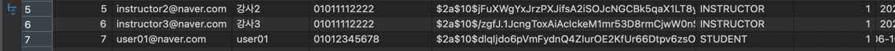

# 서비스 기본 설명

`class` 서비스는 API, Core, Domain 으로 구성됩니다.

```
.
├── api
├── service
├── domain
```

---

# Services

* api
  * application 영역
  * 외부에서의 진입점

* service
  * 비지니스로직 영역
  * transaction 을 가지고 있다.
    * repository
    * Service
  * DB 영역은 언제든 분리 가능할수 있도록 Package를 분리함.
    * Module로 분리해도 무관함.

* domain
  * Service -> Controller로 데이터 전달
    * 이는 Entity를 Controller 영역으로 전파하지 않기 위함.
  * Service -> Entity 사용시도 가능
    * 추후 DB Module이 분리되어 DB Spec이 변경될 경우를 대비한다.
  * domain 객체 정의

---

# 사전준비

* IntelliJ IDEA
* OpenJDK 17
  * curl -s "https://get.sdkman.io" | bash
  * sdk install java 17.0.6-tem
* Kotlin version - 1.9.24
* Spring Boot version - 3.0.6

# Tools

- docker client 설치
- `docker-compose.yml`
  - 로컬 db를 세팅하기 위한 docker-compose 파일

* Docker 기동
  * > cd tools && docker-compose up --build -d

* Docker 기동 상태 확인
  * > docker ps
  * class-redis, class-mysql 기동 확인

---

# Flyway

* 초기 Flyway로 Table, 초기 데이터 생성.
  * 현재 경로 확인
    > pwd
  * 경로가 tools에 있다면 root로 이동.
    ```cd ..```
    * flyway 최초 시작시 BaseLine 수행.
    ```
    ./gradlew flywayBaseline
    ./gradlew flywayClean 
    ./gradlew flywayMigrate
    ```
  * 문제가 있을 경우 Clean 수행.
    > ./gradlew flywayClean
  * flyway 초기 데이터 Migrate 수행.
    > ./gradlew flywayMigrate

# Entity 추가시

* entity 추가후 querydsl에서 사용하려면 아래 명령어를 실행.
```./gradlew kaptKotlin```

# Application 구동
```
./gradlew :api:clean :api:build
./gradlew :api:bootRun
```

# Swagger 접속정보 & API Test


* http://localhost:8080/swagger-ui/index.html
  * /api/users는 인증없이 요청 가능함.
  * 강의관련 정보는 로그인 인증후 요청해야함.
  * Auhorize를 선택하여 로그인후 발급된 Token을 입력하여 Header에 포함되어 요청되게한다.


* 각 요청하고자하는 API를 선택하여 Try it out을 클릭
  
* 원하는 Parameter를 입력하고 Execute 클릭
  
* Response의 응답을 확인!
  [img_4.png](img_4.png)
* 저장된 데이터 확인
  


